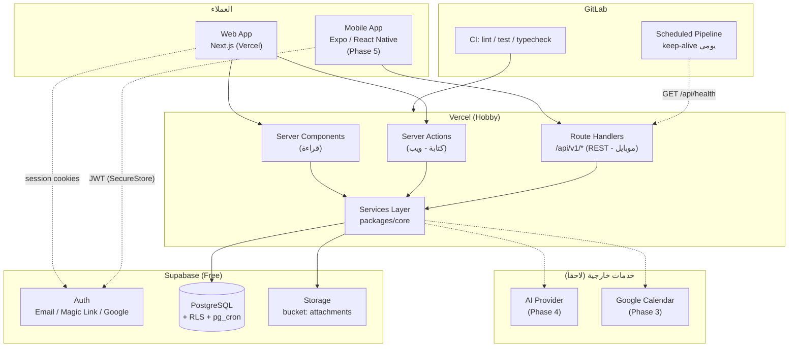

# Bawsala (بوصلة) — وثيقة المعمارية

> الحالة: **مسودة للمراجعة** — لا يبدأ أي كود قبل الموافقة على هذه الوثيقة.
>
> الوثائق المرتبطة: [database-schema.md](./database-schema.md) · [project-structure.md](./project-structure.md) · [roadmap.md](./roadmap.md) · [deployment.md](./deployment.md)

---

## 1. الرؤية والنطاق

Bawsala نظام تشغيل شخصي للإنتاجية (Personal Productivity OS) يربط الرؤية طويلة المدى بالتنفيذ اليومي:

```
Vision → Goals → Areas → Projects → Tasks → Daily Actions → Habits → Reviews
```

المستخدم يجب أن يعرف دائماً: **ماذا أفعل؟ لماذا؟ وكيف يخدم هذا هدفي الأكبر؟**

### 1.1 حدود النطاق (MVP)

| داخل MVP (المرحلتان 1 و2)           | خارج MVP (مراحل لاحقة)                    |
| ----------------------------------- | ----------------------------------------- |
| Auth + Profile                      | Knowledge Management (Notes, Links, Tags) |
| Vision / Goals / Areas / Projects   | Learning (Books, Courses, Skills)         |
| Tasks + محرك الأولويات (Rule-based) | Time Tracking + Calendar                  |
| Habits (عامة + روحية) + Streaks     | Templates المتقدمة                        |
| Daily + Weekly Review               | AI Features                               |
| i18n (ar/en) + RTL + Dark mode      | Mobile App                                |

---

## 2. المبادئ المعمارية

1. **Multi-tenant من اليوم الأول:** كل جدول يحمل `user_id` ومحمي بـ Row Level Security. التحويل لـ SaaS يضيف `workspace_id` والفوترة فقط.
2. **Business Logic خارج الإطار (Framework-agnostic):** محرك الأولويات، حساب التقدم، حساب الـ Streaks، والـ Validation schemas تعيش في `packages/core` كدوال نقية. نفس الكود يعمل في Web، Mobile، وأي API مستقبلي.
3. **API-first داخل Next.js:** كل عملية كتابة تمر عبر طبقة Services واحدة، سواء جاءت من Server Action (ويب) أو Route Handler (موبايل). لا يوجد منطق داخل الـ UI.
4. **i18n و RTL مواطنان من الدرجة الأولى:** لا يُكتب نص مباشر في المكونات، ولا تُستخدم خصائص CSS اتجاهية (`ml/mr`) بل المنطقية (`ms/me`).
5. **Rule-based قبل AI:** الذكاء الاصطناعي طبقة اقتراحات فوق محرك قواعد يعمل بدونه.
6. **صفر تكلفة في المرحلة الشخصية:** كل خدمة مختارة لها خطة مجانية دائمة وتدعم دومين فرعي عند الحاجة.
7. **Soft delete + Audit columns:** `created_at`, `updated_at`, `deleted_at` في كل جدول.

---

## 3. مخطط النظام



---

## 4. معمارية الواجهة (Frontend)

| البند                 | القرار                                | السبب                                                                                          |
| --------------------- | ------------------------------------- | ---------------------------------------------------------------------------------------------- |
| الإطار                | **Next.js (App Router) + TypeScript** | RSC للقراءة السريعة، Server Actions للكتابة، Route Handlers للـ API، استضافة مجانية على Vercel |
| التنسيق               | **Tailwind CSS + shadcn/ui**          | مكونات قابلة للتعديل بالكامل، تصميم Minimal افتراضياً، دعم RTL بخصائص منطقية                   |
| الحالة (Server state) | **TanStack Query**                    | Caching، Optimistic updates، إعادة الجلب عند الاتصال                                           |
| الحالة (UI state)     | **Zustand**                           | خفيف، للـ Sidebar، Modals، Filters، Focus timer                                                |
| النماذج               | **React Hook Form + Zod**             | نفس الـ Zod schemas مشتركة مع الخادم عبر `packages/core`                                       |
| i18n                  | **next-intl** مع segment `[locale]`   | رسائل ar/en في ملفات JSON، `dir` تلقائي على `<html>`                                           |
| الثيم                 | **next-themes**                       | Light / Dark / System بدون Flash                                                               |
| الحركة                | **Framer Motion** (محدود)             | انتقالات خفيفة فقط: fade، slide، layout. لا حركات ثقيلة                                        |
| الأيقونات             | **lucide-react**                      | متناسقة مع shadcn                                                                              |
| المحرر (Phase 3)      | **Tiptap**                            | Markdown + روابط بين الملاحظات                                                                 |

### 4.1 نظام التصميم

- **الألوان:** Neutral palette فقط (أبيض، أسود، درجات رمادي) + لون Accent واحد (أزرق هادئ أو أخضر زيتي) قابل للتبديل من إعدادات المستخدم.
- **الحالات الدلالية** فقط للـ Success / Warning / Danger، بدرجات مخففة.
- **الخطوط:** `Inter` للإنجليزية، `IBM Plex Sans Arabic` أو `Noto Sans Arabic` للعربية، تحمّل حسب الـ locale.
- **الكثافة:** Compact افتراضياً، مسافات 4px grid.

### 4.2 التنظيم الداخلي (Feature-Sliced)

كل ميزة (goals, tasks, habits...) تملك مجلدها الخاص يحوي: `components/`, `hooks/`, `actions.ts`, `queries.ts`, `schemas.ts`. المكونات المشتركة فقط في `components/ui`. التفاصيل في [project-structure.md](./project-structure.md).

---

## 5. معمارية الخادم (Backend داخل Next.js)

### 5.1 لماذا لا NestJS الآن؟

لا توجد استضافة Node دائمة التشغيل مجانية وموثوقة تدعم دومين فرعي (Railway وFly ألغيا الخطة المجانية، Render المجاني ينام بعد 15 دقيقة). Serverless على Vercel يستجيب فوراً. **التصميم يسمح بالاستخراج لاحقاً** لأن كل المنطق في `packages/core`.

### 5.2 الطبقات

```
Request (Server Action | Route Handler)
   │
   ▼
Validation  ── Zod schema من packages/core
   │
   ▼
Service     ── packages/core/services/*  (منطق الأعمال، دوال نقية تستلم db client)
   │
   ▼
Repository  ── Drizzle ORM queries (typed)
   │
   ▼
PostgreSQL  ── RLS يتحقق من user_id في كل صف
```

- **Server Actions** للويب: تستدعي Service مباشرة، تُعيد `{ data } | { error }` موحّد.
- **Route Handlers** `/api/v1/*` للموبايل والتكاملات: REST + JSON، Auth عبر `Authorization: Bearer <supabase_jwt>`.
- **Errors:** كلاس `AppError { code, message, status }` مع أكواد ثابتة (`TASK_NOT_FOUND`, `VALIDATION_FAILED`, `UNAUTHORIZED`) تُترجم في الواجهة.
- **Rate limiting:** Upstash Ratelimit (مجاني) على الـ Route Handlers فقط، عند فتح الـ API للموبايل.

### 5.3 عقد الـ API (REST v1)

```
GET    /api/v1/health
GET    /api/v1/me

GET    /api/v1/goals?horizon=annual&status=active
POST   /api/v1/goals
PATCH  /api/v1/goals/:id
DELETE /api/v1/goals/:id

GET    /api/v1/tasks?view=today|inbox|upcoming|project:<id>
POST   /api/v1/tasks
PATCH  /api/v1/tasks/:id
POST   /api/v1/tasks/:id/complete
GET    /api/v1/tasks/recommendations       # أعلى N مهمة حسب priority_score

GET    /api/v1/habits
POST   /api/v1/habits/:id/log               # { date, value, metadata }
GET    /api/v1/habits/:id/analytics?range=30d

GET    /api/v1/reviews?type=daily&date=...
PUT    /api/v1/reviews/:id

GET    /api/v1/progress/vision              # rollup كامل
```

نفس نمط CRUD لـ `projects`, `areas`, `notes`, `books`, `courses`, `time-entries`, `templates`. كل الاستجابات: `{ data, meta? }` أو `{ error: { code, message, details? } }`.

---

## 6. قاعدة البيانات

- **PostgreSQL على Supabase** (500MB مجاناً).
- **Drizzle ORM** للـ schema والـ migrations (typed، خفيف، SQL-first).
- **RLS** مفعّل على كل جدول: `user_id = auth.uid()`.
- **pg_cron** للمهام المجدولة داخل القاعدة.
- المخطط الكامل والـ ERD في [database-schema.md](./database-schema.md).

---

## 7. المصادقة والصلاحيات

| البند    | القرار                                                                          |
| -------- | ------------------------------------------------------------------------------- |
| المزود   | **Supabase Auth**                                                               |
| الطرق    | Email + Password، Magic Link، Google OAuth                                      |
| الويب    | `@supabase/ssr` — الجلسة في Cookies (HttpOnly)، تحديث تلقائي في `middleware.ts` |
| الموبايل | `supabase-js` + `expo-secure-store` للـ Refresh token                           |
| الحماية  | RLS في القاعدة (الخط الأخير)، + تحقق في Services (الخط الأول)                   |
| الأدوار  | `profiles.role`: `user` الآن، `admin` لاحقاً. أدوار الـ Workspace في مرحلة SaaS |
| الخصوصية | تصدير كامل للبيانات (JSON) + حذف الحساب من الإعدادات منذ MVP                    |

---

## 8. تخزين الملفات

- **Supabase Storage**، bucket خاص `attachments` (1GB مجاناً).
- المسار: `{user_id}/{entity_type}/{entity_id}/{uuid}.{ext}`.
- RLS على `storage.objects`: المستخدم يقرأ ويكتب داخل مجلده فقط.
- الوصول عبر **Signed URLs** (صلاحية ساعة).
- حد الملف: 5MB، ضغط الصور على العميل قبل الرفع (`browser-image-compression`).
- سجل الملفات في جدول `attachments` (polymorphic) لتتبع الحجم وإمكانية التنظيف.

---

## 9. المهام الخلفية (Background Jobs)

| المهمة                                            | الآلية                                                             | التوقيت                                                  |
| ------------------------------------------------- | ------------------------------------------------------------------ | -------------------------------------------------------- |
| حساب Streaks وتجميد المفقود                       | `pg_cron` → SQL function `recalculate_streaks()`                   | يومياً 00:10 بتوقيت المستخدم (تُخزن `profiles.timezone`) |
| Rollup التقدم (Tasks → Projects → Goals → Vision) | **Trigger** عند تغيير حالة المهمة + تحديث `progress_cache`         | فوري                                                     |
| توليد مراجعة يومية فارغة                          | `pg_cron`                                                          | يومياً                                                   |
| Keep-alive لمنع إيقاف Supabase                    | GitLab Scheduled Pipeline → `GET /api/v1/health`                   | يومياً                                                   |
| تذكيرات (Email)                                   | Phase 3: Resend (3000 رسالة/شهر مجاناً) عبر Supabase Edge Function | حسب الإعداد                                              |

عند الانتقال لـ NestJS في مرحلة SaaS تُستبدل بـ BullMQ + Redis دون تغيير المنطق (موجود في `packages/core`).

---

## 10. محرك الأولويات (Priority Engine)

يعمل بالكامل بالقواعد، ويعيش في `packages/core/priority.ts`:

```ts
// كل المدخلات 1..5 ما عدا المذكور
priority_score =
  importance * 0.25 +
  urgency * 0.2 + // مشتقة من due_date: <1d=5, <3d=4, <7d=3, <30d=2, else 1
  impact * 0.2 +
  goal_contribution * 0.2 + // 5 إذا مرتبطة بهدف نشط عالي الأولوية، 1 إذا غير مرتبطة
  (6 - difficulty) * 0.05 + // الأسهل يحصل دفعة صغيرة (Quick wins)
  energy_fit * 0.1; // 5 إذا طاقة المهمة تطابق طاقة المستخدم الحالية (من Daily Review)
```

- **Eisenhower Quadrant** مشتق: `importance >= 4 && urgency >= 4` → Q1 وهكذا.
- **Recommendations:** أعلى 3-5 مهام حسب `priority_score` مع فلترة بـ `estimate_minutes <= الوقت المتاح`.
- كل الأوزان في ملف config واحد ليتمكن المستخدم لاحقاً من تعديلها (Settings → Prioritization).

---

## 11. حساب التقدم (Progress Engine)

- **Task:** `done = 1`, غير ذلك `0`، الوزن = `estimate_minutes` (أو 1 إن لم يُحدد).
- **Project:** `Σ(weight × done) / Σ(weight)` للمهام غير المحذوفة.
- **Goal:** متوسط موزون لمشاريعه (`projects.weight`، افتراضي 1) + إمكانية **Manual override** (`goals.manual_progress`) للأهداف الكمية (مثلاً: قراءة 24 كتاباً).
- **Vision:** متوسط الأهداف النشطة.
- **Bottom-up** يُحسب ويُخزن في `progress_cache` عبر Triggers. **Top-down** مجرد عرض للشجرة مع النِسَب.

---

## 12. الذكاء الاصطناعي (Phase 4)

- **Adapter محايد** في `packages/ai` مع واجهة `LLMProvider { complete(), stream() }` وتطبيقات لـ OpenAI / Anthropic / Gemini / Ollama (محلي).
- **حالات الاستخدام بالترتيب:**
  1. تفكيك هدف إلى مشاريع ومهام مقترحة.
  2. إعادة ترتيب أولويات اليوم مع تبرير نصي.
  3. تلخيص المراجعة الأسبوعية واستخراج الأنماط.
  4. ربط الملاحظات تلقائياً (Embeddings عبر `pgvector` المتاح في Supabase).
- **الخصوصية:** Opt-in صريح، إرسال الحد الأدنى من السياق، لا تخزين لدى المزود.
- **التقنية:** Vercel AI SDK للـ Streaming عبر Route Handler.

---

## 13. استراتيجية الموبايل (Phase 5)

- **Expo + React Native** في `apps/mobile`.
- إعادة استخدام: `packages/core` (المنطق، Zod، الأنواع)، `packages/api-client` (Typed fetch للـ `/api/v1`)، `packages/i18n` (نفس ملفات الترجمة).
- Auth عبر `supabase-js` مباشرة، البيانات عبر `/api/v1`.
- Offline-first عبر TanStack Query persist + قائمة مزامنة للمهام والعادات (الأكثر استخداماً على الهاتف).
- قبل ذلك: **PWA** للويب (Manifest + Service Worker) يغطي الاستخدام الشخصي على الهاتف مجاناً.

---

## 14. قابلية التوسع ومسار SaaS

| المرحلة   | المستخدمون | البنية                                                            | التكلفة التقديرية |
| --------- | ---------- | ----------------------------------------------------------------- | ----------------- |
| شخصي      | 1          | Vercel Hobby + Supabase Free                                      | 0$                |
| Beta خاصة | 10-100     | Vercel Hobby + Supabase Free/Pro                                  | 0-25$             |
| SaaS      | 100-10k    | Vercel Pro + Supabase Pro + Upstash Redis + Resend                | ~50-100$          |
| نمو       | 10k+       | استخراج API إلى NestJS (Fly/Railway)، Read replicas، CDN للمرفقات | حسب الحمل         |

**ما يتغير عند SaaS:**

1. إضافة `workspaces` + `workspace_members` وتعديل RLS من `user_id` إلى `workspace_id`.
2. الفوترة: Lemon Squeezy أو Paddle (Merchant of Record، أسهل ضريبياً من Stripe لمطور فردي).
3. Feature flags حسب الخطة (`plans` table).
4. Onboarding + Landing page منفصلة (`apps/landing`).

---

## 15. سجل القرارات المعمارية (ADRs)

| #   | القرار                               | البدائل المرفوضة      | السبب                                                                               |
| --- | ------------------------------------ | --------------------- | ----------------------------------------------------------------------------------- |
| 1   | Next.js Fullstack                    | NestJS منفصل، Django  | لا استضافة Node مجانية دائمة؛ Serverless بلا Cold start مزعج؛ المنطق قابل للاستخراج |
| 2   | PostgreSQL                           | MongoDB               | البيانات علائقية وهرمية بامتياز (Rollups، Joins، RLS)                               |
| 3   | Supabase                             | Neon + Auth.js + R2   | حزمة واحدة مجانية: DB + Auth + Storage + Cron، أقل تكاملات                          |
| 4   | Drizzle                              | Prisma                | أخف، SQL-first، Migrations أوضح مع RLS                                              |
| 5   | Monorepo (pnpm + Turborepo)          | Repos منفصلة          | مشاركة `core` بين Web و Mobile                                                      |
| 6   | Expo لاحقاً + PWA أولاً              | Flutter، Native       | أقصى إعادة استخدام؛ PWA تكفي الاستخدام الشخصي                                       |
| 7   | Rule-based priority أولاً            | AI من البداية         | شفافية، صفر تكلفة، قابل للتفسير                                                     |
| 8   | Feature-by-feature (Vertical slices) | Frontend أولاً كاملاً | منتج قابل للاستخدام مبكراً؛ الـ UI يتشكل حول بيانات حقيقية                          |
